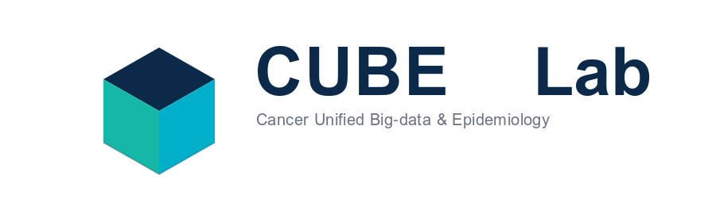

<!-- CUBE Lab README -->

  

# CUBE Lab

> **Cancer Unified Big‑data & Epidemiology**  
> 국립암센터 암빅데이터센터 데이터결합팀 산하 연구랩

**우리가 하는 일**
- AI/NLP 기반 임상·공공데이터 분석
- 국민건강영양조사(KNHANES) 등 공공데이터 기반 역학 연구
- 유전체/오믹스 데이터 통합 및 예측모델링

**연락처**
- 웹사이트: https://ncdc-cube-lab.github.io/cube-website/

---

## Quick Links
- [Branding (로고/배너)](branding/cube_lab_social_banner.png)
- [Code of Conduct](CODE_OF_CONDUCT.md) ・ [Contributing](CONTRIBUTING.md) ・ [Security](SECURITY.md)  
- [CITATION.cff](CITATION.cff) ・ [LICENSE](LICENSE)

## Social Preview
이 저장소의 링크 미리보기 이미지는 **Settings → Social preview**에서 업로드합니다.  
권장 크기: **1280×640px, 1MB 이하, PNG/JPG/GIF** 입니다. (예: `branding/cube_lab_social_banner.svg`를 PNG로 내보내 변환 업로드)

---

# CUBE Lab (EN)

**What we do**
- AI/NLP for clinical & public data
- Real‑world epidemiology using national/public datasets (e.g., KNHANES)
- Multi‑omics analytics & predictive modeling

**Contact**
- Website: https://ncdc-cube-lab.github.io/cube-website/

---

### Notes
- 본 저장소에는 **개인식별 가능 데이터(PHI/PII)를 업로드하지 않습니다**.
- 대용량 공개 데이터는 Git LFS 사용을 권장합니다.
